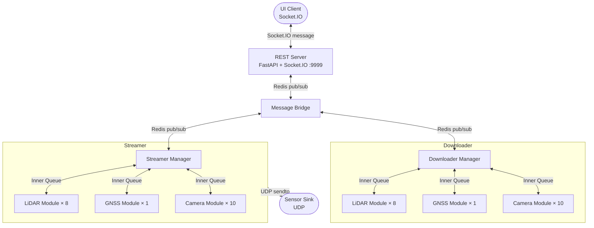
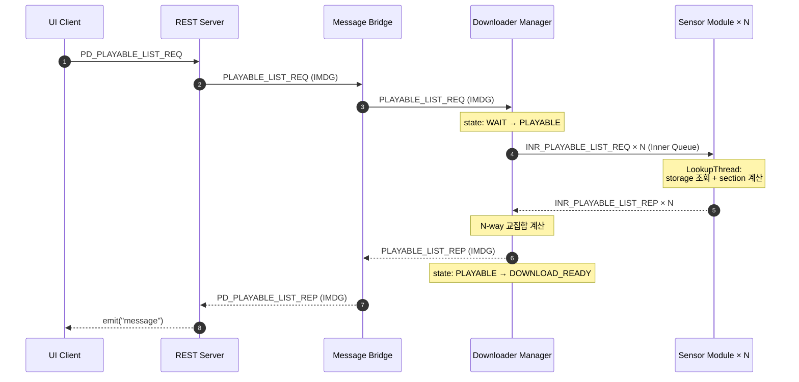

# sensor-data-replayer

자율주행 차량의 멀티 센서 데이터(LiDAR, GNSS, Camera)를 수집·처리하는 분산 파이프라인 시스템.

## 개요

차량에 장착된 센서로부터 데이터를 수신하고, UI 클라이언트의 요청에 따라 센서 데이터를 다운로드·재생(UDP 송출)하는 파이프라인입니다. 4개의 독립 프로세스(`REST Server`, `Message Bridge`, `Downloader`, `Streamer`)가 Redis pub/sub을 통해 통신합니다.

## 아키텍처



- **Downloader**: storage(LocalStorage / 추후 S3)에서 pcap 등 원본 데이터를 받아 로컬 캐시에 저장
- **Streamer**: 로컬 캐시의 pcap을 읽어 센서별 IP/PORT로 UDP 송출 (Play/Pause/Seek/Stop/Close 상태 머신)

## 지원 센서

| 타입 | 모델 | 수량 |
|------|------|------|
| LiDAR (루프) | AT128 (Front / Right / Rear / Left) | 4 |
| LiDAR (범퍼) | RSBP (Front / Right / Rear / Left) | 4 |
| GNSS | GNSS | 1 |
| Camera | AM20 (10 방향) | 10 |

## 기술 스택

| 분류 | 기술 |
|------|------|
| 언어 | Python 3.14 |
| 패키지 관리 | uv |
| REST / WebSocket | FastAPI + python-socketio + uvicorn |
| IPC 브로커 | Redis 7 (pub/sub) |
| 직렬화 | json (dataclass asdict) |
| 린팅 / 포맷 | ruff |
| 타입 체크 | pyright |
| 테스트 | pytest |
| 공통 라이브러리 | python-library (내부) |
| 스토리지 추상화 | python-library `IStorage` (LocalStorage / 추후 S3) |

## 디렉터리 구조

```
sensor-data-replayer/
├── conf/
│   ├── application.conf           # 서비스 설정 (Redis, REST, Storage 등)
│   └── logging.conf               # 로깅 설정
├── scripts/
│   ├── dev.sh                     # 3 프로세스 + test_client 통합 실행
│   └── seed_storage.py            # 통합 테스트용 더미 데이터 generator
├── src/
│   ├── app/
│   │   ├── downloader/            # 다운로더 프로세스 (manager + sensor modules)
│   │   ├── streamer/              # 스트리머 프로세스 (manager + sensor modules, state machine)
│   │   ├── message_bridge/        # 메시지 브릿지 프로세스
│   │   ├── rest/                  # REST / WebSocket 프로세스
│   │   └── app_object.py          # 멀티프로세스 app 베이스
│   ├── common/
│   │   ├── event_bus/             # Redis / 내부 큐 이벤트 버스
│   │   └── process/               # 프로세스 베이스 클래스
│   ├── config/                    # 설정 로더
│   ├── define/                    # 통신 타입 Enum
│   ├── pcaps/                     # PCAP reader/pool/packet (Streamer가 사용)
│   ├── process_category/          # 프로세스 카테고리 레지스트리
│   ├── sensor_category/           # 센서 enum + sensor_id ↔ category 매핑
│   ├── protocol/                  # 메시지 프로토콜 정의 (playable_list/play/pause/seek/close/stop)
│   ├── utils/                     # 공통 유틸리티
│   ├── rest_server_app.py         # REST 서버 진입점
│   ├── message_bridge_app.py      # 메시지 브릿지 진입점
│   ├── downloader_app.py          # 다운로더 진입점
│   └── streamer_app.py            # 스트리머 진입점
└── tests/
    ├── test_client/               # socket.io 클라이언트 통합 테스트 (시나리오별 분할)
    ├── test_process_category/
    └── test_state/
```

## 사전 요구사항

- Python 3.14+
- [uv](https://docs.astral.sh/uv/) 설치
- Redis 서버 실행 중 (기본: `localhost:6379`)

## 설치

```bash
# 저장소 클론
git clone git@github.com:Sinminbeom/sensor-data-replayer.git
cd sensor-data-replayer

# 의존성 설치
uv sync --dev
```

## 설정

`conf/application.conf`를 환경에 맞게 수정합니다. 모든 키는 `UPPER_SNAKE_CASE`.

```ini
[COMMON]
PROJECT_NAME = sensor-data-replayer
CHANNEL_NAME = test           ; Redis pub/sub 채널명

[STORAGE]
ROOT = /home/.../sensor-data-replayer/data   ; LocalStorage 루트 (원본 소스 — 운영 시 S3/MinIO 대체 예정)
PREFIX = raw

[STORAGE_CACHE]
ROOT = /home/.../sensor-data-replayer/data   ; Downloader가 받은 데이터를 저장하는 로컬 캐시
PREFIX = cache                ; Streamer는 후속 phase에서 이 경로를 읽음

[IMDG]
SERVER_IP = 127.0.0.1         ; Redis 호스트
SERVER_PORT = 6379            ; Redis 포트
POOL_SIZE = 10
SCHEMA_NAME = COM

[REST]
BIND_IP = 0.0.0.0
BIND_PORT = 9999              ; WebSocket 서버 포트

[STREAM]
STREAM_NAME = downloader_tasks
GROUP_NAME = downloader_group

[STREAM_OUTPUT]
; 센서별 UDP 송출 대상 (키 형식: <SENSOR_NAME>_IP / <SENSOR_NAME>_PORT)
AT128_ROOF_FRONT_IP   = 192.168.20.100
AT128_ROOF_FRONT_PORT = 2368
GNSS_IP   = 192.168.20.100
GNSS_PORT = 5000
; ... (다른 센서)

[PLAYER]
BUFFER_SIZE = 1000            ; PCAP 재생 버퍼 크기
READER_BUFFERING_TIME = 2     ; reader가 미리 채워두는 시간(초)
FILE_REFIND_COUNT = 3
FILE_REFIND_SLEEP_TIME = 0.1
```

### 스토리지 레이아웃

```
{ROOT}/{PREFIX}/{vehicle_id}/{category}/{sensor_id_lower}/{yyyyMMdd}/{HH}/{MM}/seed_{ts}.{ext}
```

- `category`: `lidar` / `gnss` / `camera` (sensor_id로부터 자동 결정)
- 파일명 끝 14자리(`YYYYMMDDHHMMSS`)에서 timestamp 추출
- 분 단위 디렉터리 파티션 (S3 prefix 효율 + 파일 수 분산)

## 실행

4개 프로세스를 각각 별도 터미널에서 실행합니다.

```bash
# 1. REST 서버
uv run python src/rest_server_app.py

# 2. 메시지 브릿지
uv run python src/message_bridge_app.py

# 3. 다운로더
uv run python src/downloader_app.py

# 4. 스트리머
uv run python src/streamer_app.py
```

또는 [scripts/dev.sh](scripts/dev.sh)로 4개 프로세스를 띄우고 test_client 시나리오까지 한 번에 실행:

```bash
./scripts/dev.sh
```

## 통합 테스트

LocalStorage용 더미 데이터를 생성하고 클라이언트로 요청을 보내 응답까지 검증.

```bash
# 1. 더미 데이터 시드 (모든 19개 센서, 1분 분량)
uv run python scripts/seed_storage.py

# 또는 커스텀
uv run python scripts/seed_storage.py \
    --vehicle-id vehicle-001 \
    --sensors AT128_ROOF_FRONT,GNSS \
    --start 20240101120000 \
    --end 20240101120300

# 2. 4 프로세스 띄우기 (위 "실행" 섹션 참고)

# 3. 시나리오별 테스트 클라이언트 (Socket.IO 송수신 + UDP 수신 검증)
uv run pytest tests/test_client/test_playable_list.py -v -s
uv run pytest tests/test_client/test_play.py         -v -s
uv run pytest tests/test_client/test_pause.py        -v -s
uv run pytest tests/test_client/test_seek.py         -v -s
uv run pytest tests/test_client/test_close.py        -v -s
uv run pytest tests/test_client/test_stop.py         -v -s
# UDP 송출까지 검증하는 lifecycle 시나리오
uv run pytest tests/test_client/test_pause_udp.py    -v -s
uv run pytest tests/test_client/test_stop_udp.py     -v -s
uv run pytest tests/test_client/test_close_udp.py    -v -s

# 4. 정리
uv run python scripts/seed_storage.py --clean
```

`scripts/dev.sh`는 위 시나리오들을 4 프로세스 기동과 함께 한 번에 실행합니다.

## 개발

```bash
# 린팅 / 포맷
uv run ruff check . --fix
uv run ruff format .

# 타입 체크
uv run pyright

# 테스트
uv run pytest
```

## 메시지 프로토콜

UI 클라이언트는 Socket.IO `message` 이벤트로 JSON 메시지를 전송하고 동일 채널로 응답을 수신합니다.

### 요청 (PD_PLAYABLE_LIST_REQ)

```json
{
  "protocol_id": "PD_100",
  "message_direction": 0,
  "sender": "UI",
  "receiver": "REST_SERVER",
  "vehicle_id": "vehicle-001",
  "sensor_id_list": ["AT128_ROOF_FRONT", "GNSS"],
  "start_time": "20240101120000",
  "end_time": "20240101120100"
}
```

### 응답 (PD_PLAYABLE_LIST_REP)

```json
{
  "protocol_id": "PD_101",
  "message_direction": 1,
  "sender": "MESSAGE_BRIDGE/MESSAGE_BRIDGE",
  "receiver": "REST_SERVER/REST_SERVER",
  "code": "OK",
  "code_nm": "OK",
  "reason": "",
  "sensor_id_list": ["AT128_ROOF_FRONT", "GNSS"],
  "section_list": [
    { "sectionId": 0, "startTime": "20240101120000", "endTime": "20240101120100" }
  ]
}
```

| protocol_id | 방향 | 설명 |
|---|---|---|
| `PD_100` (PD_PLAYABLE_LIST_REQ) | UI → REST | 재생 가능한 센서 데이터 목록 요청 |
| `PD_101` (PD_PLAYABLE_LIST_REP) | REST → UI | 모든 요청 센서가 동시에 보유한 시간 구간 (1초 단위 교집합) |
| `PD_200` / `PD_201` (PLAY)       | UI ↔ REST | 재생 시작 — Streamer가 UDP 송출 개시 |
| `PD_400` / `PD_401` (PAUSE)      | UI ↔ REST | 일시정지 |
| `PD_500` / `PD_501` (SEEK)       | UI ↔ REST | 특정 timestamp로 이동 |
| `PD_300` / `PD_301` (CLOSE)      | UI ↔ REST | 세션 종료 |
| `PD_600` / `PD_601` (STOP)       | UI ↔ REST | 재생 중지 |

`section_list`의 각 element는 `[startTime, endTime]` 1초 단위 연속 구간 — 모든 요청 센서가 그 구간에 데이터를 가지고 있음을 보장.

내부적으로 각 `PD_*` 외부 프로토콜은 IMDG(Redis pub/sub) 단계의 `숫자` 프로토콜과 sensor module 단계의 `-숫자` (INR_) 프로토콜로 fan-out 됩니다. 정의는 [src/protocol/protocol_meta.py](src/protocol/protocol_meta.py)의 `E_PROTOCOL_ID`를 참조하세요.

## 흐름 요약



